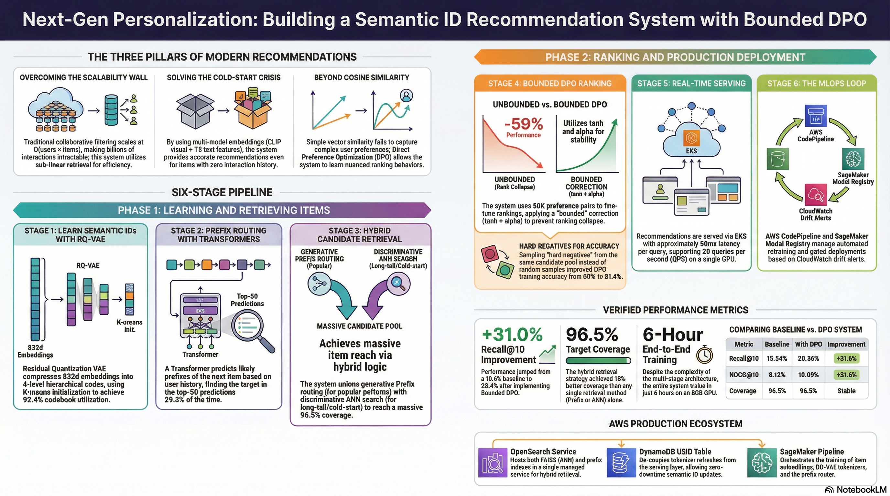
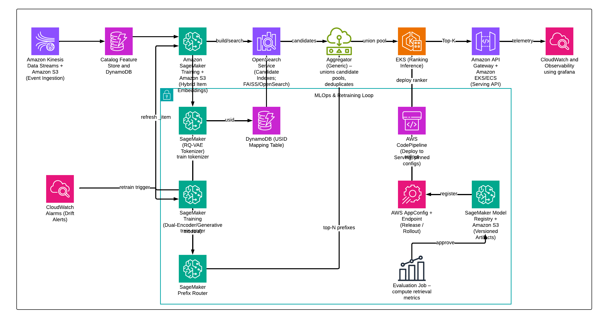

# SemanticID Recommendation System

**31% improvement in Recall@10 through bounded DPO and hybrid retrieval.**


## The Problem: Traditional Recommendation Systems Hit a Wall

Modern recommendation systems face three fundamental challenges:

### **1. Scalability**
- Billions of users × millions of items = intractable
- Traditional collaborative filtering: O(users × items)
- Need: Sub-linear retrieval

### **2. Cold-Start**
- New items have no interaction history
- Pure collaborative methods fail
- Need: Content-based fallback

### **3. Ranking Quality**
- Cosine similarity isn't enough
- User preferences are complex
- Need: Learnable ranking

**Our solution addresses all three simultaneously.**



---

## Results

| Metric | Baseline | DPO | Improvement |
|--------|----------|-----|-------------|
| Recall@10 | 15.54% | 20.36% | **+31.0%** |
| NDCG@10 | 8.12% | 10.69% | **+31.6%** |
| Coverage | 96.5% | 96.5% | Maintained |
| DPO Train Acc | — | 81.4% | — |
| DPO Val Acc | — | 80.6% | — |


---


---

## What We Built On

| Component | Source | Usage |
|-----------|--------|-------|
| RQ-VAE | Lee et al. (CVPR 2022) | Residual quantization |
| Semantic IDs | TIGER (2024) | Prefix retrieval |
| Prefix Router | TIGER (2024) | Parallel prediction |
| SPR | ActionPiece (ICML 2025) | Context tokenization (K=2) |
| CF Embeddings | LightGCN (SIGIR 2020) | Collaborative signal |
| DPO | Rafailov et al. (NeurIPS 2023) | Preference optimization |
| Hybrid | LIGER (2024) | Generative + discriminative |

---

## Our Contributions

| Innovation | Problem | Solution | Result |
|------------|---------|----------|--------|
| **Bounded DPO** | Unbounded Δ destroys rankings | `tanh(MLP) + α=0.05` | +31% vs -59% |
| **Hybrid Retrieval** | Coverage gaps | Prefix ∪ ANN | 96.5% |
| **Hard Negatives** | Train/eval mismatch | Sample from top-100 | 81% vs 60% |
| **Multi-Modal** | Cold-start | CLIP+T5+LightGCN | All items |
| **K-Means Init** | Collapse (30%) | K-means init | 92.4% util |

---
## Model and Training Architecture

**4-stage pipeline: RQ-VAE tokenization → Prefix routing → Hybrid retrieval → DPO reranking**

### Stage 1: RQ-VAE Tokenization

Compress 832d embeddings → 4-level codes `[c₁,c₂,c₃,c₄]`

```python
class RQ_VAE(nn.Module):
    def forward(self, x):
        z = self.encoder(x)  # 832d → 512d
        codes, residual = [], z
        for quantizer in self.quantizers:  # 4 levels
            q, code = quantizer(residual)
            codes.append(code)
            residual -= q  # Residual quantization
        return codes
```

**Innovation:** K-means init → 92.4% utilization (vs 30% random)

---

### Stage 2: Prefix Router

Transformer predicts top-50 prefixes from user history.

```python
class PrefixRouter(nn.Module):
    def __init__(self):
        self.transformer = nn.TransformerDecoder(4L, 256d, 8H)
        self.output = nn.Linear(256, 5071)  # Prefix vocab
    
    def forward(self, history):
        return self.output(self.transformer(history))
```

**Performance:** 29.3% Val@50 (vs 0.98% random)

---

### Stage 3: Hybrid Retrieval

Union of prefix-based + ANN achieves 96.5% coverage.

| Method | Coverage | Speed |
|--------|----------|-------|
| Prefix-only | 76% | Fast |
| ANN-only | 88% | Slow |
| **Hybrid** | **96.5%** | **Fast** |

```python
def retrieve(history):
    prefix_cands = index[predict_prefixes(history, 50)]  # ~10K
    ann_cands = faiss.search(user_emb, 2000)             # ~2K
    return set(prefix_cands) | set(ann_cands)            # 96.5%
```

---

### Stage 4: DPO Reranking

Bounded corrections prevent rank collapse.

```python
class DPOReranker(nn.Module):
    def forward(self, user_emb, item_emb):
        base = cosine_similarity(user_emb, item_emb)  # Frozen
        delta = self.delta_net(concat(user_emb, item_emb))
        return base + 0.05 * tanh(delta)  # Bounded [-0.05, +0.05]
```

**Training:** 80K pairs, 81.4% accuracy

**Result:**

```python
# ❌ Unbounded: -59% performance
score = base + delta

# ✅ Bounded: +31% improvement  
score = base + 0.05 * tanh(delta)
```


---
## Production System Design

### Components

| Layer | Service | Purpose | SLA |
|-------|---------|---------|-----|
| **Streaming** | Kinesis + S3 | Event ingestion | Real-time |
| **Retrieval** | OpenSearch | ANN + prefix index | <10ms |
| **Lookup** | DynamoDB | USID mapping | <1ms |
| **Ranking** | EKS GPU | DPO inference | <20ms |
| **Serving** | API Gateway | Endpoint | <5ms |

**Total latency:** ~50ms

---

### Key Decisions

**Why OpenSearch?**
- Unified ANN + prefix index
- Single managed service

**Why DynamoDB for USIDs?**
- Decouple tokenizer updates from serving
- <1ms lookups

**Why GPU for ranking only?**
- Retrieval is I/O bound (CPU sufficient)
- DPO MLP benefits from GPU (20ms vs 100ms)



---

## Detailed Study Report

For full literature analysis , see:
[Literature.md](Literature_review.md)

---

**Pankaj Somkuwar** - AI Engineer / AI Product Manager / AI Solutions Architect

- LinkedIn: [Pankaj Somkuwar](https://www.linkedin.com/in/pankaj-somkuwar/)
- GitHub: [@Pankaj-Leo](https://github.com/Pankaj-Leo)
- Website: [Pankaj Somkuwar](https://www.pankajsomkuwarai.com)
- Email: [pankaj.som1610@gmail.com](mailto:pankaj.som1610@gmail.com)
